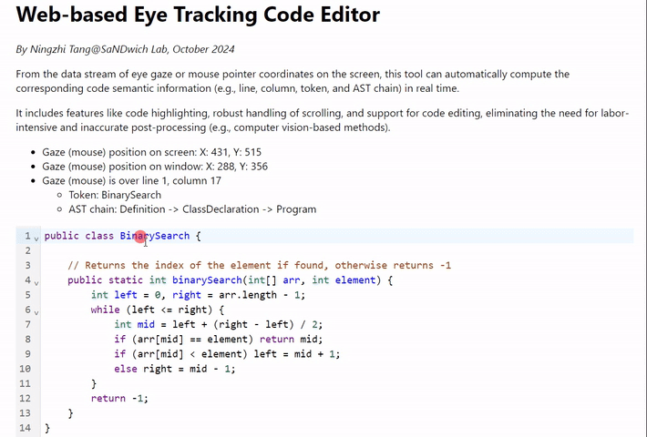

# Web-based Eye Tracking Code Editor

🚀 **[Try our live demo here!](https://webeyecode.netlify.app/)** 🎉

## Motivation

Recently, researchers in the empirical software engineering community have become increasingly interested in using eye tracking to understand how developers read and write code. However, converting eye gaze data into semantic information (e.g., line, column, token) is technically challenging.

While existing tools like [CodeGRITS](https://codegrits.github.io/CodeGRITS/) or [iTrace](https://www.i-trace.org/) provide in-IDE solutions, many researchers still prefer to use web-based experimental setups for several reasons:
- **Convenient study design.** Participants may not need to modify code or rely on IDE features;
- **Support for collecting other data types.** Enables gathering additional data, such as summary writing or surveys;
- **Feasibility of remote data collection.** Allows easy link sharing with participants, particularly using webcam-based eye tracking.

However, existing web-based experimental setups (e.g., [[1]](https://dl.acm.org/doi/full/10.1145/3664808), [[2]](https://dl.acm.org/doi/abs/10.1145/3643732), [[3]](https://onlinelibrary.wiley.com/doi/full/10.1002/smr.2706)) present several limitations:

- **No code highlighting.** That differs from participants' daily coding experience and may affect their reading behavior;
- **Labor-intensive and inaccurate post-processing.** For example, using OpenCV to detect the bounding box of each token from screenshots and OCR to recognize the text;
- **Limited code length.** The entire code must be displayed on the screen, and participants cannot scroll;
- **Difficulty in explaining AST semantics.** This requires reparsing the code and remapping the tokens to AST nodes post-hoc;
- **No support for code editing.**

## Solution

We developed a technical workflow for a web-based eye tracking code editor that addresses these limitations. The key idea is to use [CodeMirror](https://codemirror.net/), a popular web-based code editor, to provide code highlighting and editing features. We convert eye gaze data into semantic information by leveraging CodeMirror's APIs and resolving numerous technical issues.

Below is a snapshot of our tool in action (using the mouse as a proxy for eye gaze). Feel free to try our [live demo](https://webeyecode.netlify.app/) as well!

    

The main technical details can be found in `/src/components/CodeMirrorEditor.js`. Please refer to them if you want to adapt this tool for your research. We also provided an example for publishing gaze/mouse data streams from a Python server in `/public/mouse_simulation.py` (often needed in practice, as the Tobii Pro SDK doesn't provide JavaScript APIs).

> We previously tried the [Monaco Editor](https://microsoft.github.io/monaco-editor/), another popular web-based code editor with core features same as VSCode. However, Monaco Editor doesn't offer any APIs to convert coordinates to the offset or line/column position in the code, which is essential for analyzing eye tracking data.

## Contact

For more information, please contact [Ningzhi Tang](mailto:ntang@nd.edu) from the [SaNDwich Lab](https://toby.li/) at the University of Notre Dame. I'm happy to discuss the technical details and potential collaborations!

If you prefer an in-IDE solution, check out [CodeGRITS](https://codegrits.github.io/CodeGRITS/), developed by our team for JetBrains IDEs, which also supports tracking developer interactions within the IDE.